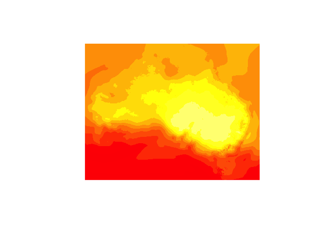
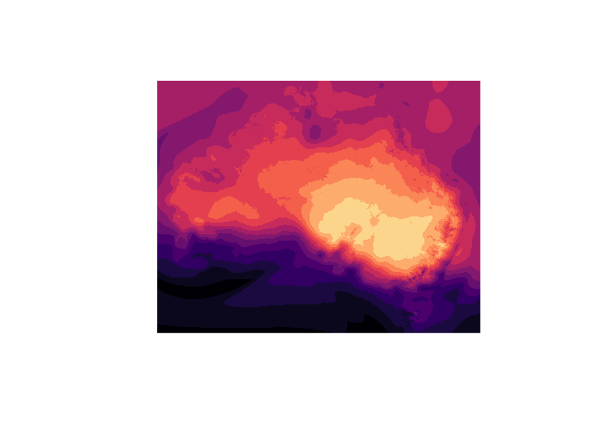
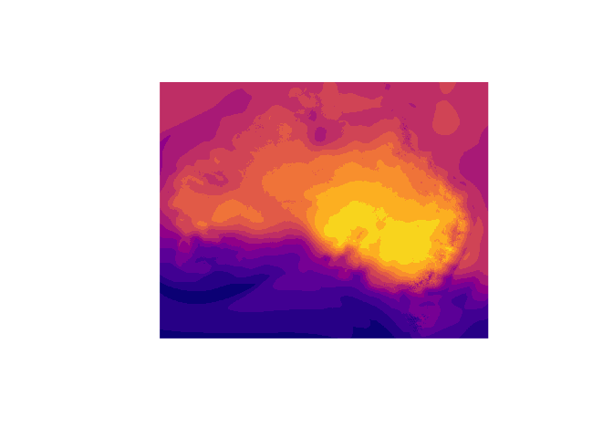
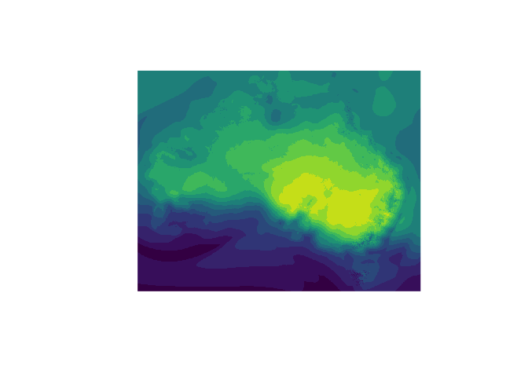
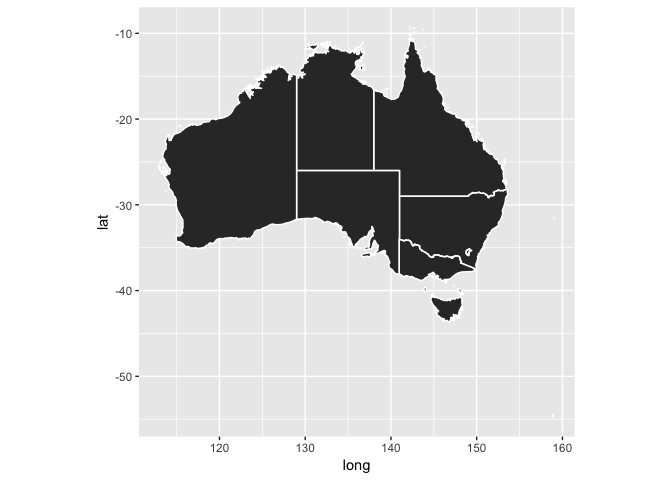
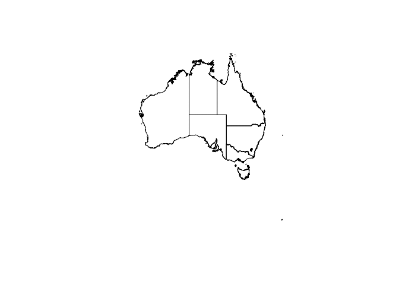
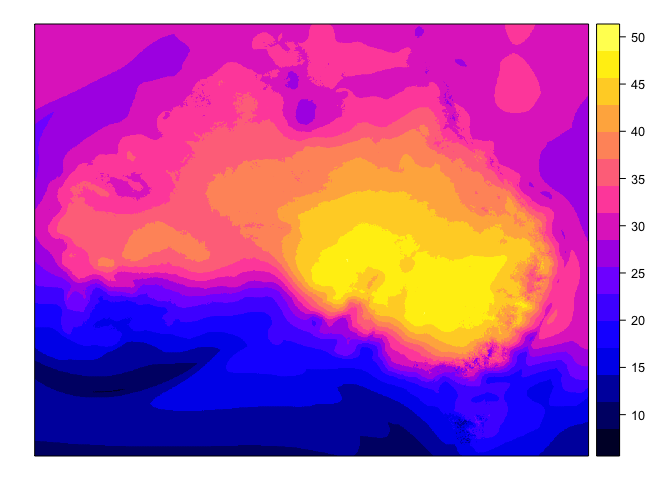
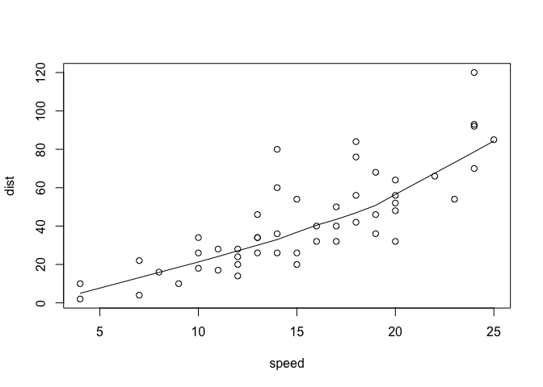
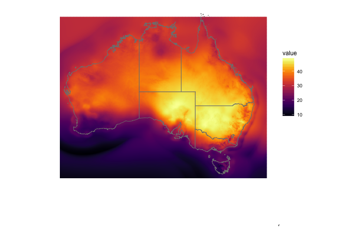

There's a heatwave in Australia at the moment. And this is the heatmap that is getting shown of Australia:

``` r
knitr::include_graphics("bom-heat-map.png")
```


Which shows that things are really hot.

But it's also pretty darn ugly.

I wanted to see if I could make it better, using awesome packages like `viridis` to colour the heat more appropriately.

So this repository is me documenting my struggle with shapefiles and geospatial data. I haven't had to work with this sort of data before, so I'm making an effort to be as transparent as possible with my thoughts on doing this.

Eventually this will get written up into a blog post. But I figured that it would be nice to put on github like this, so that others can contribute, if they like.

OK, so first we load the packages.

``` r
library(rgdal)
```

    ## Loading required package: sp

    ## rgdal: version: 1.2-5, (SVN revision 648)
    ##  Geospatial Data Abstraction Library extensions to R successfully loaded
    ##  Loaded GDAL runtime: GDAL 2.1.2, released 2016/10/24
    ##  Path to GDAL shared files: /Users/tierneyn/Library/R/3.3/library/sf/gdal
    ##  Loaded PROJ.4 runtime: Rel. 4.9.1, 04 March 2015, [PJ_VERSION: 491]
    ##  Path to PROJ.4 shared files: /Users/tierneyn/Library/R/3.3/library/sf/proj
    ##  Linking to sp version: 1.2-3

``` r
library(rgeos)
```

    ## rgeos version: 0.3-22, (SVN revision 544)
    ##  GEOS runtime version: 3.4.2-CAPI-1.8.2 r3921 
    ##  Linking to sp version: 1.2-4 
    ##  Polygon checking: TRUE

``` r
library(maptools)
```

    ## Checking rgeos availability: TRUE

``` r
library(ggplot2)
library(viridis)
```

Then we load the data, retrieved from [the bom site](http://www.bom.gov.au/jsp/awap/temp/index.jsp) - thanks to [Robbi Bishop Taylor](https://twitter.com/robbibt) for pointing out where to get it!

``` r
library(ozviridis)
data("oz_heat")

class(oz_heat)
```

    ## [1] "SpatialGridDataFrame"
    ## attr(,"package")
    ## [1] "sp"

``` r
# oz_heat <- readGDAL("2017-02-11-oz-heat.grid") # reads in the whole raster
```

Quick methods for plotting
==========================

OK, so I can get a pretty basic plot with base `image`.

``` r
image(oz_heat) # does a plot
```



But the colour scale isn't great.

With the `viridis` package I can make them look pretty.

``` r
image(oz_heat,
      col = viridis(15,
                    option = "magma")
      )
```



``` r
image(oz_heat,
      col = viridis(15,
                    option = "plasma")
      )
```



``` r
image(oz_heat,
      col = viridis(15,
                    option = "viridis")
      )
```



There's also the default `spplot` from `sp`

``` r
spplot(oz_heat,
       col = viridis(15,
                     option = "plasma"))
```


So, the goal from here is to:

-   Add the shapefile of Australia
-   use `sf`
-   Plot using ggplot
-   add better legends etc to make it look more similar to the BoM image

Adding the shapefile of Australia
---------------------------------

ROpenSciLabs has a `naturalearthdata` package that is fast and easy to use. Thank you to adamhsparks for finding this and adding to the README!

``` r
# if (!require("devtools")) install.packages("devtools")
# devtools::install_github("ropenscilabs/rnaturalearth")

library("rnaturalearth")

oz_shape <- rnaturalearth::ne_states(geounit = "australia")

sp::plot(oz_shape)
```


Using `sf`
----------

We can convert this to a simple features with `st_as_sf`:

``` r
# convert to simple features
oz_shape_sf <- sf::st_as_sf(oz_shape)

head(oz_shape_sf)
```

    ## Simple feature collection with 6 features and 59 fields
    ## geometry type:  MULTIPOLYGON
    ## dimension:      XY
    ## bbox:           xmin: 112.9194 ymin: -54.75042 xmax: 158.9632 ymax: -10.96836
    ## epsg (SRID):    4326
    ## proj4string:    +proj=longlat +datum=WGS84 +no_defs
    ##     adm1_code OBJECTID_1 diss_me adm1_cod_1 iso_3166_2 wikipedia iso_a2
    ## 168   AUS+00?       3640   10015    AUS+00?        AU-      <NA>     AU
    ## 169  AUS-1932       1618    1932   AUS-1932        AU-      <NA>     AU
    ## 170  AUS-2650       6324    2650   AUS-2650        AU-      <NA>     AU
    ## 171  AUS-2651       6322    2651   AUS-2651        AU-      <NA>     AU
    ## 172  AUS-2653       2572    2653   AUS-2653        AU-      <NA>     AU
    ## 173  AUS-2654       2573    2654   AUS-2654        AU-      <NA>     AU
    ##     adm0_sr                         name name_alt name_local      type
    ## 168       5             Macquarie Island     <NA>       <NA>      <NA>
    ## 169       1         Jervis Bay Territory     <NA>       <NA> Territory
    ## 170       6           Northern Territory     <NA>       <NA> Territory
    ## 171       6            Western Australia     <NA>       <NA>     State
    ## 172       1 Australian Capital Territory     <NA>       <NA> Territory
    ## 173       1              New South Wales     <NA>       <NA>     State
    ##       type_en code_local code_hasc note hasc_maybe region region_cod
    ## 168      <NA>       <NA>        AU <NA>       <NA>   <NA>       <NA>
    ## 169 Territory       <NA>     AU.JB <NA>       <NA>   <NA>       <NA>
    ## 170 Territory       <NA>     AU.NT <NA>       <NA>   <NA>       <NA>
    ## 171     State       <NA>     AU.WA <NA>       <NA>   <NA>       <NA>
    ## 172 Territory       <NA>     AU.CT <NA>       <NA>   <NA>       <NA>
    ## 173     State       <NA>     AU.NS <NA>       <NA>   <NA>       <NA>
    ##     provnum_ne gadm_level check_me scalerank datarank abbrev postal
    ## 168          0          0       20        10       10   <NA>   <NA>
    ## 169          2          1       20         2        3 J.B.T.     JB
    ## 170          7          1       20         2        3   N.T.     NT
    ## 171          5          1       20         2        3   W.A.     WA
    ## 172          1          1       20         2        3 A.C.T.     CT
    ## 173          9          1       20         2        3 N.S.W.     NS
    ##     area_sqkm sameascity labelrank          featurecla name_len mapcolor9
    ## 168         0        -99        20 Admin-1 aggregation       16         2
    ## 169         0        -99         2  Admin-1 scale rank       20         2
    ## 170         0        -99         2  Admin-1 scale rank       18         2
    ## 171         0        -99         2  Admin-1 scale rank       17         2
    ## 172         0          9         9  Admin-1 scale rank       28         2
    ## 173         0        -99         2  Admin-1 scale rank       15         2
    ##     mapcolor13 fips fips_alt   woe_id                         woe_label
    ## 168          7 <NA>     <NA> 22528478                              <NA>
    ## 169          7 <NA>     <NA>  1102841                              <NA>
    ## 170          7 AS03     <NA>  2344701 Northern Territory, AU, Australia
    ## 171          7 AS08     <NA>  2344706  Western Australia, AU, Australia
    ## 172          7 AS01     <NA>  1100968                              <NA>
    ## 173          7 AS02     <NA>  2344700    New South Wales, AU, Australia
    ##               woe_name latitude longitude sov_a3 adm0_a3 adm0_label
    ## 168   Macquarie Island -54.5929   158.898    AU1     AUS          5
    ## 169         Jervis Bay -35.1532   150.692    AU1     AUS          2
    ## 170 Northern Territory -20.1026    133.78    AU1     AUS          2
    ## 171  Western Australia -25.8483   121.646    AU1     AUS          2
    ## 172           Canberra -35.4618   148.983    AU1     AUS          2
    ## 173    New South Wales -32.4751   146.781    AU1     AUS          2
    ##         admin  geonunit gu_a3    gn_id                      gn_name
    ## 168 Australia Australia   AUS        0                         <NA>
    ## 169 Australia Australia   AUS -2177478 Australian Capital Territory
    ## 170 Australia Australia   AUS  2064513           Northern Territory
    ## 171 Australia Australia   AUS  2058645   State of Western Australia
    ## 172 Australia Australia   AUS  2177478 Australian Capital Territory
    ## 173 Australia Australia   AUS  2155400     State of New South Wales
    ##       gns_id                     gns_name gn_level gn_region gn_a1_code
    ## 168        0                         <NA>        0      <NA>        AU.
    ## 169        0                         <NA>       -1      <NA>        AU.
    ## 170 -1592100           Northern Territory        1      <NA>      AU.03
    ## 171 -1608952            Western Australia        1      <NA>      AU.08
    ## 172 -1556567 Australian Capital Territory        1      <NA>      AU.01
    ## 173 -1591422              New South Wales        1      <NA>      AU.02
    ##     region_sub sub_code gns_level gns_lang gns_adm1 gns_region
    ## 168       <NA>     <NA>         0     <NA>     <NA>       <NA>
    ## 169       <NA>     <NA>         0     <NA>     <NA>       <NA>
    ## 170       <NA>     <NA>         1      zho     AS03       <NA>
    ## 171       <NA>     <NA>         1      zho     AS08       <NA>
    ## 172       <NA>     <NA>         1      zho     AS01       <NA>
    ## 173       <NA>     <NA>         1      zho     AS02       <NA>
    ##                           geometry
    ## 168 MULTIPOLYGON(((158.86573326...
    ## 169 MULTIPOLYGON(((150.61305546...
    ## 170 MULTIPOLYGON(((136.69548587...
    ## 171 MULTIPOLYGON(((122.24694993...
    ## 172 MULTIPOLYGON(((149.38176598...
    ## 173 MULTIPOLYGON(((150.70378273...

Plot using ggplot2
------------------

You can plot this directly from the spatial data, using the following method as described in the tidyverse here, <https://github.com/tidyverse/ggplot2/wiki/plotting-polygon-shapefiles>:

``` r
ggplot(oz_shape) +
   aes(x = long, 
       y = lat, 
       group = group) + 
     geom_polygon() +
     geom_path(color = "white") +
     coord_equal()
```

    ## Regions defined for each Polygons



But there are some ways to plot this using the new package `sf`. Do add the temperatures, I think I'll need to add this for each row of each feature.

``` r
nc <- sf::st_read(system.file("shape/nc.shp", package = "sf"), quiet = TRUE)

head(nc)
```

    ## Simple feature collection with 6 features and 14 fields
    ## geometry type:  MULTIPOLYGON
    ## dimension:      XY
    ## bbox:           xmin: -81.74107 ymin: 36.07282 xmax: -75.77316 ymax: 36.58965
    ## epsg (SRID):    4267
    ## proj4string:    +proj=longlat +datum=NAD27 +no_defs
    ##    AREA PERIMETER CNTY_ CNTY_ID        NAME  FIPS FIPSNO CRESS_ID BIR74
    ## 1 0.114     1.442  1825    1825        Ashe 37009  37009        5  1091
    ## 2 0.061     1.231  1827    1827   Alleghany 37005  37005        3   487
    ## 3 0.143     1.630  1828    1828       Surry 37171  37171       86  3188
    ## 4 0.070     2.968  1831    1831   Currituck 37053  37053       27   508
    ## 5 0.153     2.206  1832    1832 Northampton 37131  37131       66  1421
    ## 6 0.097     1.670  1833    1833    Hertford 37091  37091       46  1452
    ##   SID74 NWBIR74 BIR79 SID79 NWBIR79                       geometry
    ## 1     1      10  1364     0      19 MULTIPOLYGON(((-81.47275543...
    ## 2     0      10   542     3      12 MULTIPOLYGON(((-81.23989105...
    ## 3     5     208  3616     6     260 MULTIPOLYGON(((-80.45634460...
    ## 4     1     123   830     2     145 MULTIPOLYGON(((-76.00897216...
    ## 5     9    1066  1606     3    1197 MULTIPOLYGON(((-77.21766662...
    ## 6     7     954  1838     5    1237 MULTIPOLYGON(((-76.74506378...

However, the `ggplot2::geom_sf` unfortunately gives an error when plotting.

``` r
ggplot(nc) +
  geom_sf(aes(fill = AREA)) 
# Error in sign(x) : non-numeric argument to mathematical function
```

So where to from here?

Perhaps back to base?

``` r
sp::plot(oz_shape)
```



``` r
spplot(oz_heat)
```



I feel like there should be some way for me to just write something like:

``` r
sp::plot(oz_shape,
         fill = oz_heat)
```

But then this makes me start thinking how I'm used to with ggplot2 - where everything is in a dataframe. Which means that, given that my `sf` dataframe is 11 rows long:

``` r
tibble::as_tibble(oz_shape_sf)
```

    ## # A tibble: 11 × 60
    ##    adm1_code OBJECTID_1 diss_me adm1_cod_1 iso_3166_2 wikipedia iso_a2
    ## *     <fctr>     <fctr>  <fctr>     <fctr>     <fctr>    <fctr> <fctr>
    ## 1    AUS+00?       3640   10015    AUS+00?        AU-        NA     AU
    ## 2   AUS-1932       1618    1932   AUS-1932        AU-        NA     AU
    ## 3   AUS-2650       6324    2650   AUS-2650        AU-        NA     AU
    ## 4   AUS-2651       6322    2651   AUS-2651        AU-        NA     AU
    ## 5   AUS-2653       2572    2653   AUS-2653        AU-        NA     AU
    ## 6   AUS-2654       2573    2654   AUS-2654        AU-        NA     AU
    ## 7   AUS-2655       2555    2655   AUS-2655        AU-        NA     AU
    ## 8   AUS-2656       2554    2656   AUS-2656        AU-        NA     AU
    ## 9   AUS-2657       6323    2657   AUS-2657        AU-        NA     AU
    ## 10  AUS-2659       2557    2659   AUS-2659        AU-        NA     AU
    ## 11  AUS-2660       2553    2660   AUS-2660        AU-        NA     AU
    ## # ... with 53 more variables: adm0_sr <fctr>, name <fctr>,
    ## #   name_alt <fctr>, name_local <fctr>, type <fctr>, type_en <fctr>,
    ## #   code_local <fctr>, code_hasc <fctr>, note <fctr>, hasc_maybe <fctr>,
    ## #   region <fctr>, region_cod <fctr>, provnum_ne <fctr>,
    ## #   gadm_level <fctr>, check_me <fctr>, scalerank <fctr>, datarank <fctr>,
    ## #   abbrev <fctr>, postal <fctr>, area_sqkm <fctr>, sameascity <fctr>,
    ## #   labelrank <fctr>, featurecla <fctr>, name_len <fctr>,
    ## #   mapcolor9 <fctr>, mapcolor13 <fctr>, fips <fctr>, fips_alt <fctr>,
    ## #   woe_id <fctr>, woe_label <fctr>, woe_name <fctr>, latitude <fctr>,
    ## #   longitude <fctr>, sov_a3 <fctr>, adm0_a3 <fctr>, adm0_label <fctr>,
    ## #   admin <fctr>, geonunit <fctr>, gu_a3 <fctr>, gn_id <fctr>,
    ## #   gn_name <fctr>, gns_id <fctr>, gns_name <fctr>, gn_level <fctr>,
    ## #   gn_region <fctr>, gn_a1_code <fctr>, region_sub <fctr>,
    ## #   sub_code <fctr>, gns_level <fctr>, gns_lang <fctr>, gns_adm1 <fctr>,
    ## #   gns_region <fctr>, geometry <S3: sfc_MULTIPOLYGON>

Each row in an `sf` dataframe describes a polygon, and then there are associated values for each of those polygons. So, in order for me to plot the associated colours with each feature, there should then be some interpolation process going on to give each polygon some sort of spatially smoothed temperature value.

This is almost certainly my naïvety showing, but all I really want, is to plot the shape file, and then overlay the appropriately smoothed plot. Sort of like how one can do:

``` r
plot(cars)
lines(lowess(cars))
```



I'd like to do something like

``` r
plot(oz_shape)
colours(oz_heat)
```

But I guess the problem here is how to combine those two pieces of information of different size.

There is not clear way to go from mapping the colours on a grid, to the shapefile, and what comes after this will be some sort of interpolation step to the shapefiles and polygons.

Or maybe I'm completely wrong about this. And maybe I'm overthinking it and just need to do some proper reading in the right place.

Bob Rudis's answer on SO
------------------------

Munging the code from [Bob Rudis's answer on Stack Overflow](http://stackoverflow.com/a/33234951/3764040) about using ggplot2 to plot a raster I have something pretty close to what I'm after.

``` r
library(rasterVis)
```

    ## Loading required package: raster

    ## Loading required package: lattice

    ## Loading required package: latticeExtra

    ## Loading required package: RColorBrewer

    ## 
    ## Attaching package: 'latticeExtra'

    ## The following object is masked from 'package:ggplot2':
    ## 
    ##     layer

``` r
library(ggthemes)
class(oz_shape)
```

    ## [1] "SpatialPolygonsDataFrame"
    ## attr(,"package")
    ## [1] "sp"

``` r
test <- raster(oz_heat)
test_spdf <- as(test, "SpatialPixelsDataFrame")
test_df <- as.data.frame(test_spdf)
colnames(test_df) <- c("value", "x", "y")
```

So here, we specify the raster tiles of the heat information, along with the polygon from the map, and then provide the scale using the Inferno option.

``` r
oz_heat_map <-
ggplot() +  
  geom_tile(data = test_df, 
            aes(x = x, 
                y = y, 
                fill = value)) + 
  geom_polygon(data = oz_shape, 
               aes(x = long, 
                   y = lat, 
                   group = group), 
               fill = NA, 
               color = "grey10", 
               size = 0.3) +
  scale_fill_viridis(option = "inferno") +
  coord_equal() +
  theme_map() +
  theme(legend.position = c(0.95, 0.5))
```

    ## Regions defined for each Polygons

``` r
  # theme(legend.key.width=unit(2, "cm"))
```

``` r
oz_heat_map
```



I owe Bob a beer.

My friend Maëlle also pointed me to [Bob's blog post](https://rud.is/b/2016/07/27/u-s-drought-animations-with-the-witchs-brew-purrr-broom-magick/) that does a bit more of what I want, I think.

Add better legends etc to make it look more similar to the BoM image
--------------------------------------------------------------------

Getting there! But for another day.

Things that I want to do before I write this up as a blog post:

-   Control the level of smoothing of the tiles, perhaps bin up the temperatures in 5 degree bins.
-   Make sure that this approach I'm taking is inline with the current state of the art - should I be using `sf`, can I use `geom_sf`? And more.
